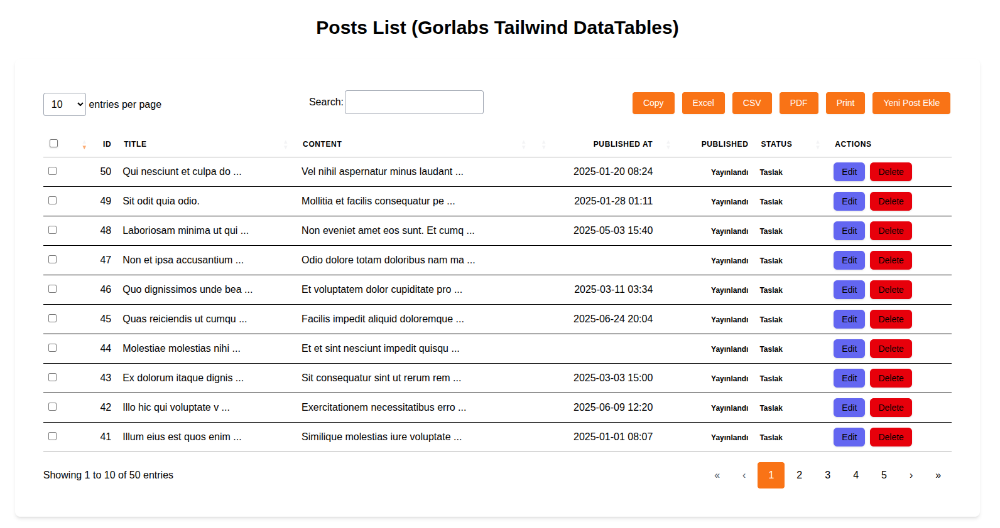

# Gorlabs Laravel Tailwind DataTables Package

[](docs/tr/giris.md)

## Quick Start Guides

For installation and detailed usage steps, please review the following guides:

* [Laravel Breeze Livewire Stack Setup](docs/en/setup-livewire.md)
* [Laravel Breeze Vue.js Stack Setup](docs/en/setup-vue.md)
* [Basic Usage and Configuration](docs/en/basic-usage.md)
* [Column Customization Examples](docs/en/column-customization.md)

You can follow these documents to better understand your package.



A fully customizable package that seamlessly integrates the full power of Yajra DataTables with the modern Tailwind CSS and Alpine.js interface into your Laravel projects. Easily manage everything from server-side processing to rich column customization.


## Features

* **Seamless Integration:** Provides all core Yajra DataTables features (server-side processing, searching, pagination, sorting, buttons) with Tailwind CSS and Alpine.js.
* **Reusability:** A Composer package that can be easily integrated into Laravel projects.
* **Customizability:** Easily adapts to your own Tailwind configurations and theme colors.
* **Performance:** Maintains performance by preserving the existing Yajra infrastructure.
* **Backward Compatibility:** Easy and secure updates with versioning compliant with SemVer rules.
* **Easy Getting Started Experience:** Quickly start using with quick start guides and clear examples.
* **Rich Column Customization:** Easily apply visual enhancements like date formats, status badges, text truncation, and more.

## Installation and Usage

To add the package to your Laravel project via Composer:

```bash
composer require gorlabs/tailwind-datatables
```

### Configuration

You can publish the configuration file to modify the package's default settings:

```bash
php artisan vendor:publish --tag=gorlabs-tailwind-datatables-config
```

This command will copy the config/gorlabs-tailwind-datatables.php file to your project.

### Asset Publishing (If Needed)

To publish the package's CSS files to your project's resources/css directory (to include in your own Tailwind pipeline):

```bash
php artisan vendor:publish --tag=tailwind-datatables-css
```
This command will copy the published CSS files under resources/css. You will need to import these files in your own resources/css/app.css file. A separate publishing command is not required for JavaScript files; they can be imported directly from the vendor directory.
## Example Projects
You can examine our ready-to-use example projects to see how the package works with Livewire and Vue.js stacks. These projects are full-fledged Laravel applications demonstrating the installation and basic usage of the package.
### Running Example Projects

Each example project manages its own dependencies and database. 

1.  **Clone the Main Package:**
    ```bash
    git clone https://github.com/gorlabs/tailwind-datatables.git
    cd tailwind-datatables
    ```
2.  **Run the Vue.js Example:**
    ```bash
    cd examples/vue
    composer install         # Install dependencies (automatically links main package)
    npm install              # Install frontend dependencies
    cp .env.example .env     # Create .env file
    php artisan key:generate
    php artisan migrate:fresh --seed # Create database and seed data
    npm run dev              # Start Vite development server
    php artisan serve        # Start Laravel development server
    # Open http://localhost:8000/posts in your browser (or login)
    ```
3.  **Run the Livewire example:**
    ```bash
    cd ../livewire
    composer install
    npm install
    cp .env.example .env
    php artisan key:generate
    php artisan migrate:fresh --seed
    npm run dev
    php artisan serve
    # Open your Livewire page in the browser
    ```

## Contributing

Bug reports, feature requests, and code contributions are welcome. Please refer to the [Contributing Guide](CONTRIBUTING.md).

## License

The Gorlabs Laravel Tailwind DataTables package is released under the MIT License..
Buy me a coffee  or http://www.buymeacoffee.com/gorlabs
