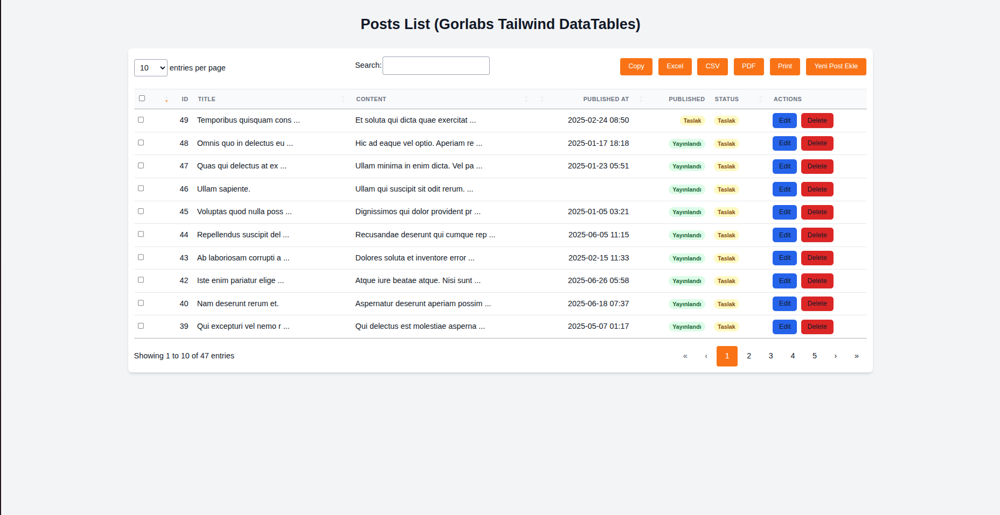

# Gorlabs Laravel Tailwind DataTables

[](../../README.md)

## Hızlı Başlangıç Kılavuzları

Kurulum ve detaylı kullanım adımları için lütfen aşağıdaki kılavuzları inceleyin:


* [Laravel Breeze Livewire Stack ile Kurulum](kurulum-livewire.md) 
* [Laravel Breeze Vue.js Stack ile Kurulum](kurulum-vue.md) 
* [Temel Kullanım ve Yapılandırma](temel-kullanim.md)  
* [Kolon Özelleştirme Örnekleri](kolon-ozellestirme.md) 


Paketinizi daha iyi anlamak için bu dokümanları takip edebilirsiniz.



Yajra DataTables'ın tüm gücünü, modern Tailwind CSS ve Alpine.js arayüzü ile Laravel projelerinize kusursuzca entegre eden, tamamen özelleştirilebilir bir paket. Sunucu tarafı işlemden zengin kolon özelleştirmesine kadar her şeyi kolayca yönetin.

## Özellikler

* **Sorunsuz Entegrasyon:** Yajra DataTables'ın tüm temel özelliklerini (sunucu tarafı işleme, arama, sayfalama, sıralama, butonlar) Tailwind CSS ve Alpine.js ile sunar.
* **Yeniden Kullanılabilirlik:** Laravel projelerine kolayca entegre edilebilir bir Composer paketi.
* **Özelleştirilebilirlik:** Kendi Tailwind konfigürasyonlarınıza ve tema renklerinize kolayca uyum sağlar.
* **Performans:** Mevcut Yajra altyapısını koruyarak performanstan ödün vermez.
* **Geriye Dönük Uyumluluk:** SemVer kurallarına uygun sürümleme ile kolay ve güvenli güncellemeler.
* **Kolay Başlangıç Deneyimi:** Hızlı başlangıç kılavuzları ve net örneklerle hızlıca kullanıma başlayın.
* **Zengin Kolon Özelleştirmesi:** Tarih formatları, durum rozetleri/badge'ler, metin kısaltma gibi görsel iyileştirmeler kolayca uygulanabilir.

## Kurulum ve Kullanım

Paketi Laravel projenize Composer ile eklemek için:

```bash
composer require gorlabs/tailwind-datatables
```
  
Konfigürasyon
Paketin varsayılan ayarlarını değiştirmek için konfigürasyon dosyasını yayımlayabilirsiniz:

```bash
php artisan vendor:publish --tag=gorlabs-tailwind-datatables-config
```

Bu komut, config/gorlabs-tailwind-datatables.php dosyasını projenize kopyalar.

Asset Yayımlama (Gerektiğinde)
Paketin CSS dosyalarını projenizin resources/css dizinine yayımlamak için (kendi Tailwind pipeline'ınıza dahil etmek üzere):

```bash
php artisan vendor:publish --tag=tailwind-datatables-css
```

Bu komut yayımlanan CSS dosyalarını resources/css altına kopyalar. Kendi resources/css/app.css dosyanızda bu dosyaları import etmeniz gerekecektir. JavaScript dosyaları için ayrıca bir yayınlama komutuna gerek yoktur, doğrudan vendor dizininden import edilebilirler.


## Örnek Projeler

Paketin Livewire ve Vue.js yığınlarıyla nasıl çalıştığını görmek için hazır örnek projelerimizi inceleyebilirsiniz. Bu projeler, paketin kurulumu ve temel kullanımını gösteren tam teşekküllü Laravel uygulamalarıdır.

### Örnek Projeleri Çalıştırma

Her bir örnek proje kendi bağımlılıklarını ve veritabanını yönetir.

1.  **Ana Paketi Klonlayın:**
    ```bash
    git clone https://github.com/gorlabs/tailwind-datatables.git
    cd tailwind-datatables
    ```
2.  **Vue.js Örneğini Çalıştırın:**
    ```bash
    cd examples/vue
    composer install         # Bağımlılıkları yükleyin (ana paketi otomatik bağlar)
    npm install              # Frontend bağımlılıklarını yükleyin
    cp .env.example .env     # .env dosyasını oluşturun
    php artisan key:generate
    php artisan migrate:fresh --seed # Veritabanını oluşturun ve verileri doldurun
    npm run dev              # Vite geliştirme sunucusunu başlatın
    php artisan serve        # Laravel geliştirme sunucusunu başlatın
    # Tarayıcınızda http://localhost:8000/posts adresine gidin (veya login olun)
    ```
3.  **Livewire Örneğini Çalıştırın:**
    ```bash
    cd ../livewire
    composer install
    npm install
    cp .env.example .env
    php artisan key:generate
    php artisan migrate:fresh --seed
    npm run dev
    php artisan serve
    # Tarayıcınızda ilgili Livewire sayfanıza gidin
    ```
 
Katkıda Bulunma
Hata raporları, özellik istekleri veya kod katkıları memnuniyetle karşılanır. Lütfen [Katkıda Bulunma Rehberi](../../CONTRIBUTING.md)'ne bakın.

Lisans
Gorlabs Laravel Tailwind DataTables paketi MIT Lisansı altında yayımlanmıştır.


